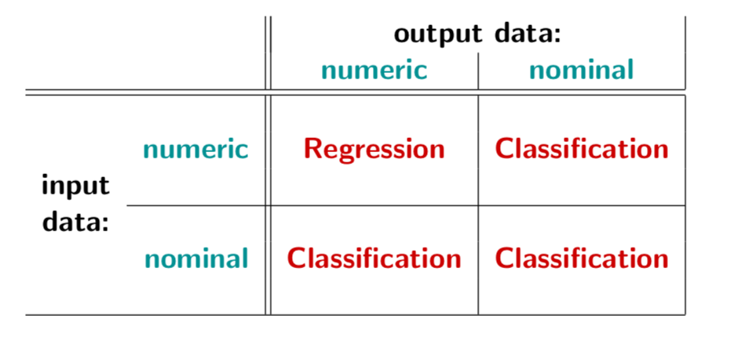
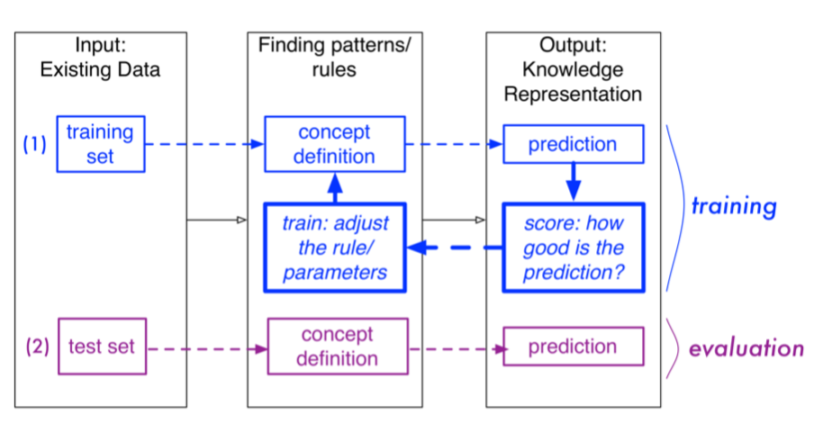

# Regression

Reference from lecture2(part 1, linear regression), lecture

## Overview

Model selection rule:




If each instance in the training set (our existing data) already has a label or a class, then this process is referred to as **supervised learning**.


### Building Classification and Regression Models

􏰀Two main steps: 

**1. Training** :

1. Select a portion of the existing data $\rightarrow$ training set
2. Initialise the parameters ($w_i$ ’s), e.g., to random values
3. Apply the rule to the training set and compute the error rate
4. Adjust the parameters ($w_i$ ’s), according to some method
5. Iterate back to step (3) until the error rate is “low enough”
6. Output is the model

**2. Evaluation**:

1. Select (the remaining) portion of the existing data as **test set**,
2. Apply the rule to the test set and compute the **error rate**
3. Output is the evaluation error




### Numeric Prediction

Goal: devise a **rule** or **function** or **concept description** or **equation** that produces numeric output from numeric input

1. Linear Regression Models
2. Linear Classification Models


## Linear Regression

There is a linear function exists between the output and the variables:
$$
y = w_0 + \sum_{i=1}^Nw_ix_i
$$
We need to find **parameters(weights, regression coefficients)** of the function that approximates the relationship between the variables ($x$) and the output ($y$).

### Gradient Descent Algorithm

1. Initialize $\omega$ with zeros (or random values):

```
for i in {1...N}:
  w_i <- 0
```

2. Repeat until convergence is archieved:

```
repeat:
//M is batch size
  for j in {1...M}:
    for i in {1...N}:
      w_i <- w_i + a*(y_j + {pred_j})*x[j,i]*(1/M)
until S(w) -> 0
```


We score the model for each instance by determining how far the $\hat{y}$ (predicted) value is from the $y$ (observed) value:
$$
y - \hat{y}
$$

We define residual:
$$
(y - \hat{y})^2
$$

We compute the **error rate** for the model with **sum of squared error**:
$$
error\ rate = \sum_{i=1}^M(y-\hat{y})^2
$$


