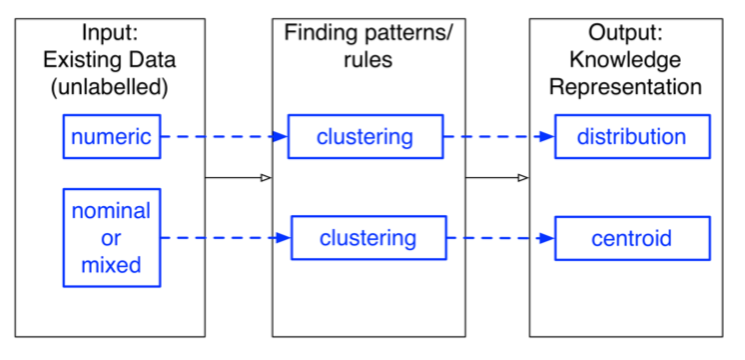

# Cluster

## Overview

**Clustering** can be defined as the process of organising instances in a dataset into groups or clusters, such that:

- instances with a high degree of similarity are in the same cluster,
- instances with a low degree of similarity are in different clusters.

The result of a clustering process is measured in two ways:

#### Within Cluster metric
How close are the instances within a cluster to each other? (aim is to minimise)

$$
wc(C) = \sum_{i=1}^{K}wc(C_i) = \sum_{i=1}^{K}\sum_{x_j \in C_i}d(x_j, c_i)^2
$$

- $C$:  the overall clustering of a dataset
- $K$:  number of clusters in the clustering
- $C_i$: the i-th cluster
- $x_j$: the j-th instance in the data set (data point) ci = centre of cluster i
- $d$: distance function
- $d(x_j,c_i)^2$: distance from each point ($x_j$) in the cluster to the centre of its cluster ($c_i$)

#### Between Cluster metric
How far apart are clusters from each other? (aim is to maximise)

$$
bc(C) = \sum_{1 \leq i \leq j \leq K}d(c_i, c_j)^2
$$

- $d(c_i,c_j)^2$:  distance between the centre of cluster i and the centre of cluster j

## Cluster Models

### K-Means clustering

1. Randomly select k points, which represent cluster centres
2. Assign all (remaining) data points to the closest cluster
3. Compute new cluster centres
4. For each point, find its closest cluster
5. Repeat from step 3, until new cluster centres are the same as the old ones (convergence)

### Hierarchical clustering

#### Agglomerative method
Nearby points are in the same cluster, Relies on Between Cluster metric

1. Start with clusters containing one data point each (singleton clusters)
2. Repeat until one cluster is left:
  - 􏰀Find pair of clusters that are closest
  - Merge the pair
  - Remove previous 2 clusters

#### Divisive method

- **Monothetic Divisive method**: splits clusters using one variable at a time.
- **Polythetic Divisive method**: makes splits on the basis of all of the variables together.

### Incremental clustering

1. Build a tree starting with just the root
2. Add instances to the tree, one at a time, by either creating a new leaf where each instance belongs or restructuring the tree (decisions based on **Category Utility metric**)
3. Repeat step 2, until all the instances are added to the tree

### Density-based clustering (DBSCAN)

Goal is to find regions in the data space that are of high density and low density, particularly looking for separation between the two types of regions.

1. Categorise all points (as core, border or noise)
2. Ignore noise points
3. Create an edge between all core points that is within Eps of each other
4. Create a cluster for each group of connected core points
5. Assign each border point to the cluster of its core point

## Evaluation

###  Within Cluster Score
### Between Cluster Score
### Overall Clustering Score

$$
\frac{bc(C)}{wc(C)}
$$

### Calinski-Harabaz Index

Uses the concept of dispersion of a set of points: the sum of squared distances of the points from their centroid.

$$
\frac{BGSS}{WGSS} * \frac{n-k}{k-1}
$$

- $k$ number of clusters
- $n$: numberofinstances
- $BGSS maximum$: between group sum of squares (dispersion)
- $WGSS minimum$: within group sum of squares (dispersion)
- higher when clusters are well separated and dense
- relatively fast to compute

### Silhouette Coefficient

$$
\frac{b-a}{max(a, b)}
$$

- 􏰀$a$: the mean distance between an instance and all other points in the same cluster
- $b$: the mean distance between an instance and all other points in the nearest cluster
- $sc = 1$ for dense clusters that are well separated
- $sc = 0$ overlappingclusters
- $sc = −1$ forincorrectclustering

### Minimum Description Length

