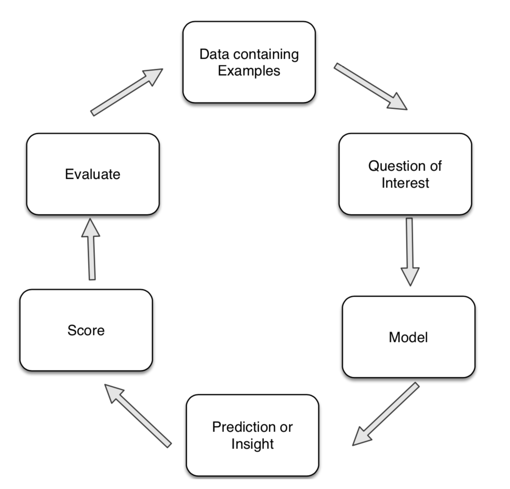

# Data Mining in the Wild

## The Process of Data Mining

In the real world, with real data, this process essential!

- Before applying data mining techniques, determine the objective of the analysis.
- Understand the data and its quality.
- Prepare (**clean** or **curate**) the data.
- Build models(s)
- Evaluate the model(s)

## Data Issues

- Data
- Data quality
- Not enough data
- Too much data

## Model Issues

- How good is the model
- What can go wrong
- Avoid learning things that are not true
- Patterns may not represent any underlying rule
- Actionable, Trivial or Surprising
- Learning things that are true but not useful
- Are we overfitting
- Training data does not reflext the relevant population

**re-substitution error**: The error rate obtained when running a model using training data.