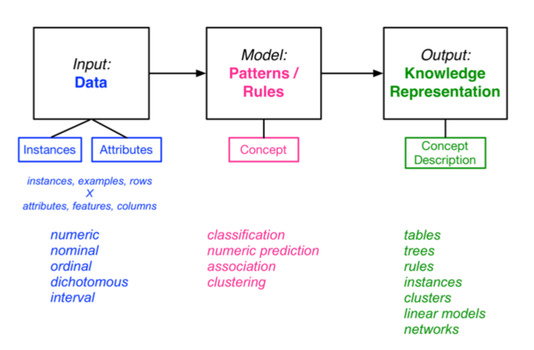

# Introduction

## Overview

### What is data mining?

Information is hidden in the data. Data Mining is finding patterns in the data and make sense of it. It involves:
1. Identifying patterns
2. Validating patterns
3. Using patterns for prediction

### Examples

1. Advertising: Users who are similar to you bought
2. Query Learning: Given a training set of example queries and documents that contain the answer, define rules that allow us to find the answer to our query based on data that is not in our training set

### Process

1. Before applying data mining techniques: Determine the objective of the analysis
2. Understand the data and its quality
3. Prepare (“clean” or “curate”) the data
4. Build model(s)
5. Evaluate the model(s)
6. Iterate... (to step 2, 3, 4, and/or 5...)

## Data Mining Concets

### Attributes (Features or Columns)

Types:
- Numeric: continuous or discrete; distance between values is well defined
		e.g. weight, age, height, temperature
- 􏰀Nominal: categorical
		e.g. occupation, weather, color
- Ordinal: ordered; distance between values is not well defined
		e.g. rank, likert scale, satisfied level
- Dichotomous: binary, Boolean (choice of two)
		e.g., gender, exam result(pass or fail)
- 􏰀Interval or Ratio

### Instances (Examples or Rows)

**Positive examples**: instances that are labelled with the right answer or instances of relationships that we are looking for

**Negative examples**: instances that are labelled with the wrong answer or instances of relationships other than what we are looking for

The **closed-world assumption** adopts the stance that rules can be constructed by only looking at positive examples.

### Data Issues

Data preparation for data mining can be time-consuming

Steps:
- 􏰀Assembly
- Integration
- Cleaning
- Aggregating
- Transformation

􏰀 Taken together, also referred to as Curation

### Model

#### 1. Classification (**supervised learning**)
Modelling the relationship between data elements and corresponding labels or “classes”.

#### 2. Numeric Prediction  (**supervised learning**)
Modelling the relationship between numbers to predict a number, or called regression

#### 3. Association
Modelling rules that associate attributes with each other to predict an attribute

#### 4. Clustering (**unsupervised learning**)
Modelling which groups of instances belong together

### Knowledge Representations

1. Tables
2. Trees
3. Rules
4. Instance-based representations
5. Clusters
6. Linear models
7. Networks

3. 

## Modelling

A **model** is an abstract representation of a real-world process or artefact. Model building in data mining is **data driven**. The aim is to **capture relationships in the data**.

### Predictive Modelling
the goal is to devise a model that predicts future data.
e.g., classification and regression

### Descriptive Modelling
the goal is to devise a model of known data
e.g., clustering

### Parametric Models
A **parametric model** is appropriate if we make assumptions about the distribution of the population from which the data set (considered a sample or subset of the population) is drawn.

**Parametric models** have a fixed number of parameters, regardless of the size of the data set.

